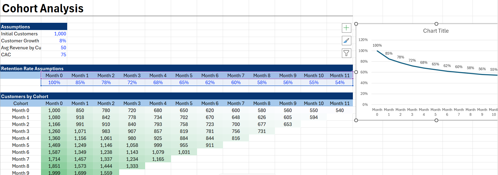
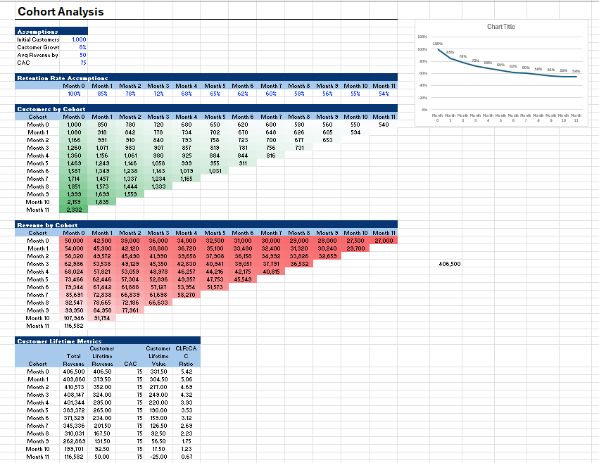

# Cohort Analysis using Excel 📊

This project focuses on **Cohort Analysis using Microsoft Excel** to study customer behavior, retention trends, and repeat purchase patterns over time.

The analysis helps understand how different customer groups (cohorts) behave after their first interaction or purchase, making it useful for **business intelligence and customer retention strategies**.

---

## 📌 Project Objective

The main objective of this project is to:

* Group customers into cohorts based on their **first purchase month**
* Track their activity in the following months
* Analyze **customer retention rate**
* Identify repeat customer behavior
* Visualize trends using an interactive **Excel dashboard**

---

## 🛠 Tools & Techniques Used

* **Microsoft Excel**
* Pivot Tables
* Pivot Charts
* Conditional Formatting
* Cohort Retention Matrix
* Heatmaps
* Dashboard Visualization
* Data Cleaning

---

## 📷 Dashboard Preview

### Dashboard Screenshot 1

### Dashboard Screenshot 2

---

## 📈 Key Insights

* Built a **month-wise retention matrix**
* Analyzed repeat customer behavior
* Identified high-retention and low-retention cohorts
* Visualized customer drop-off trends
* Derived actionable business insights

---

## 🎯 Business Use Case

Cohort analysis is widely used in:

* E-commerce analytics
* Customer retention studies
* Product growth analysis
* Subscription models
* Marketing performance tracking

---

## ✨ Learning Outcomes

Through this project, I strengthened my understanding of:

* Customer analytics
* Retention analysis
* Business intelligence concepts
* Data visualization using Excel
* Analytical thinking

---

## 📂 Files Included

* `Cohort Analyis using Excel.xlsx`
* `image1.png`
* `image2.png`
* `README.md`

---

## 👩‍💻 Author

**Saumya Jain**

If you found this project useful, feel free to ⭐ the repository.
